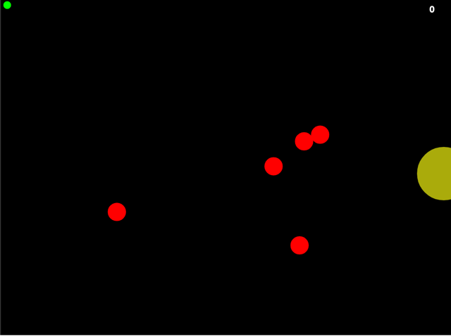
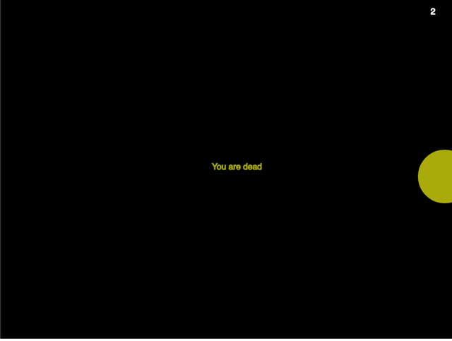

## Lerp Game 

### Base logic of the game
#### Moving Enemies in Processing:
- Using lerp, ease
- Move around multiple enemies
- Using …
  - Arrays for the enemies
  - random(lo, hi) for randomizing

#### Player should reach the yellow point, when you reach the point, you will see you won text

#### Player should avoid enemies, if he'll collide with them, he will lose.

#### Every click counts, it works like high score, less counts more points 