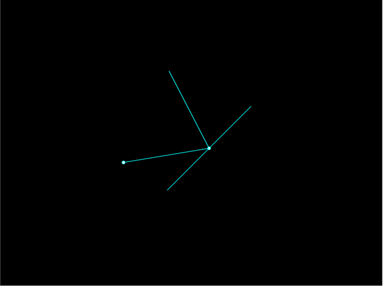

### Vector reflection
- A ball is traveling towards a wall
- Calculate the direction the ball is traveling after it bounces off the wall.

- reflect at a given point from within the window
- reflect for an arbitrary normal vector (plane)
